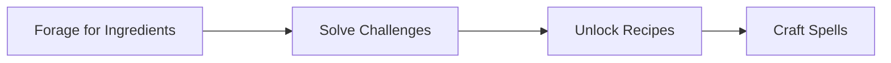

# SpellCrafter
###### Autonomous Worlds and Conditional Access Control for Substrate Native Games

- **Team Name:** Ideal Labs and Chainsafe Systems
- **Funding Details:**
  - **DOT**: For the **DOT** compensation, please provide a Polkadot address. (ex. multisig, with core contributors)

## Game Project Overview :page_facing_up:

# Game Project Application Form

## 1. Pitch the Game

### Please describe the game in a short pitch.

> This is not only a pitch for a game, but for enabling verifiable onchain randomness, tlock, and verifiable computations for web3 games. The final output of this proposal will be a game, which Ideal Labs will develop in collaboration with Chainsafe Systems. 

**SpellCrafter** is a "spell-crafting" card game where players discover ingredients, unlock recipes, and craft new spells in a challenge to be the most powerful mage. Players encounter offchain challenges (puzzles) that must be solved in order to unlock new recipes that can be used to craft spells on-chain. This game is a re-imagining of [Arcane Assembly](https://github.com/ArcaneAssemblers/spellcrafter), a game developed with Dojo (on Starknet), as a Substrate-native game. Even though a game in it's own right, SpellCrafter is intended to be a used as a source of magic spells for other games that need them for their players. In the game, players must search the web, offchain, in order to learn knowledge that they can use to unlock recipes, such as by solving a puzzle or a riddle. 

To enable SpellCrafter on Substrate, we introduce publicly verifiable on-chain randomness, timelock encryption, verifiable computation (zkSNARKs) and practical witness encryption capabilities to web3 gaming on Polkadot/Substrate. In collaboration with ChainSafe Gaming, Ideal Labs aims to enhance web3 gaming on Polkadot by leveraging the Ideal Network's [post-finality gadget](https://medium.com/@ideal_labs/the-etf-post-finality-gadget-1dd6d7f12034), an MPC solution that enables a randomness beacon, to develop a practical witness encryption mechanism. That is, it enables the usage of verifiable randomness on-chain (and across chains), allows for messages to be locked for future blocks, and provides secret sharing capabilities, wherein the network acts as a distributed key generator and constructs keys for 'authorized' users (where authorization is gated behind valid proofs). This approach ensures fair play, enables asynchronous player coordination, and introduces proof-of-knowledge gating for in-game assets, events, or anything. This would not only allow for games like [zkHunt](https://0xparc.org/blog/zk-hunt) or [dark forest](https://zkga.me/) to be implemented on Substrate, but would allow for new on-chain conditional data access mechanisms to be created, such as requiring a zkSNARK of some in-game knowledge in order to proceed to the next level.

**Keypoints**

We are proposing:
- A Substrate-native spell-crafting card game, **SpellCrafter**, where players discover ingredients, unlock recipes, and craft new spells in a challenge to craft the most powerful spells.
- A framework that provides the following features to Substrate-based web3 games:
  - **Publicly Verifiable On-Chain Randomness**: Injection of publicly verifiable randomness into games, which can be used as input or output randomness and also forms a basis for async multiparty interactions. 
  - **Timelock Encryption**: Timelock encryption allows messages to be encrypted such that they can only be decrypted after a given amount of time, or in our case, blocks, has passed. Timelock encryption is a powerful primitive for enabling more trustless systems, where it enables more streamlined commit-reveal capabilities. In the context of gaming, it can provide front-running protection for players, time-based easter eggs and feature reveals, and generally the ability to ‘send something to the future’.
  - **Trustless Secret Sharing and Conditional Access Control Mechanisms**: We introduce a new mechanism based on async committee secret sharing, timelock encryption and Groth16 that enables a trustless “**practical witness encryption**” scheme. We demonstrate how this can be used in order to incentivize a relayer network to automatically update game states and for the construction of new conditional access control mechanisms for web3 systems in general.

You can find the details of our proposed framework here: https://docs.google.com/document/d/1HYjl92HM-D6D3zYKfXIyvKz5PomhzIJgaPlmqFx5RN4/edit?usp=sharing

### Basic Gameplay Loop

Basic Gameplay Loop

### Are there any existing games that you would consider similar to your project?

SpellCrafter exists as a Starknet implementation built with the Dojo framework. There are several existing 'autonomous worlds' frameworks that enable some type of verifiable computation and/or automatic game state calcualtions and updates. Each solutions is generally targeting EVM-based blockchains, including:

- [dojo](https://book.dojoengine.org/)
- [mud](https://mud.dev/)
- [xaya](https://xaya.io/)

### Do you have a Game Design Document (GDD) for your project?

The GDD is a work in progress. Once complete, it will contain the full details of the game that we will build in collaboration with Chainsafe.

An example of what the GDD will look like can be found here:
https://chainsafe.notion.site/Game-Design-Document-for-Fragments-70ad7d8efec14fa68de9f6f4e5be55f4

## 2. Game Dev Experience

### Have you built games prior to this bounty request?

#### Martin

- **[Isonzo](https://youtu.be/GAv34SMEjMI)** 
  * Advanced Kinematic Character Controller
  * New behaviours on bots
  * Development of challenge and achievements systems
  * Game settings from scratch
  * Lead audio programming development

#### More games we have developed:
- **[Beat Cancer](https://www.youtube.com/watch?v=9hnLrSvW220)**
- **[Planet Rabbit](https://www.youtube.com/watch?v=n0XyF6U4qGs)**
- **[Block Blasterz](https://github.com/ChainSafe/BlockBlasterz)**
- **[Total Domination Reborn](https://www.youtube.com/watch?v=TM_t7uJlHAA)**
- **[Raid: Shadow Legends](https://www.youtube.com/watch?v=gmwbHdJLadE)**
- **[Greedventory](https://store.steampowered.com/app/1895820/Greedventory/)**
- **[Mortal Hockey Arcade](https://www.youtube.com/watch?v=vvzMc2pZMIs)**
- **[Ghost Rider](https://drive.google.com/file/d/1yy-myQRMyyQe8ccw42qqGsWlQjEkN5ZQ/view?usp=sharing)**
- **[Gebeta/Manchala](https://play.google.com/store/apps/details?id=com.qenegames.gebeta)**
- **[Angrymals](https://angrymals.io/)**

### Do any of the previously mentioned games have a Web3 component?
Block Blasterz is one of our web3 games that uses Etherum for its in-game currency, lootboxes, fiat-to-crypto conversion, and an NFT Marketplace. It also allows for EVM-based cross chain asset transfers with the Block Racerz game. Furthermore,we have been building and extending autonmous worlds on Ethereum (MUD framework) and on Starknet (Dojo Framework).

### Do you have experience in working with game engines, such as Unity & Unreal?
Yes, we have extensive experience working with Unity and in-depth knowledge building blockchain SDKs for Unity. We have also worked with Unreal Engine, but not as extensively as Unity. We have experience with all aspects of game development, including game design, game mechanics, game physics, and game asset creation.

## 3. Technical Expertise

### How much of your game logic do you intend to build on the blockchain?
- [ ] None, I just want a token.
- [ ] Only the Game Assets/NFTs should remain on-chain.
- [x] Some mechanics will need to be on-chain.
- [ ] This should be a fully on-chain game.
- [ ] Other: 

### Do you have any expertise in Blockchain Development?
- [ ] No, none at all.
- [ ] I know how the Blockchain works, but never developed anything in crypto.
- [x] I have EVM / SmartContract experience.
- [ ] I have only used SDK for my games on other platforms.
- [x] I know Rust & Substrate and can create basic runtime code.
- [x] Other: Highly experienced in Rust & Substrate and can develop new runtime code.

### Would you like a technical Team from Polkadot Play, to help you identify the technical requirements?
Yes, we would. While we believe we have a decent understanding of the technical requirements for this proposal, we would very much appreciate another look/perspective, as there undoubtedly some unknowns or things we may have overlooked. We would also appreciate insights into the direction of our tools and APIs to ensure that they are reasonable and serve as useful interfaces for developers.

## 4. The Team

#### Juan Girini
Juan Girini is a Co-founder and Engineer at Ideal Labs, and a former FRAME Core Engineer at Parity. He holds a degree in Information Systems Engineering and is distinguished as a graduate of the Polkadot Blockchain Academy's Buenos Aires cohort with honours. With extensive experience as a web2 engineer before transitioning to web3, Juan is immersed in the development of the Ideal Network, a groundbreaking Substrate-based blockchain with a focus on pioneering novel blockchain functionalities. There's a particular emphasis on Onchain Randomness, as well as Interoperability, Timelock Encryption, and Delayed Transactions.

#### Coleman Irby
Coleman Irby graduated in 2015 with his Bachelor's of Science in Electrical Engineering with a focus in Computer Engineering from the University of Mississippi. In 2016, Coleman was hired as a contractor in software engineering. He then spent 6 years working as a software engineer in the Financial Technology sector. During his time he taught himself many different technologies including, but not limited to, Java, C++, React, Angular, Kotlin, Javascript, and many others. In 2022, Coleman then decided to return back to the University of Mississippi to pursue his Masters degree in physics. While pursuing his masters, Coleman has joined as an engineer at Ideal Labs where he can apply his knowledge in mathematics, scientific modeling, and software engineering to help pioneer the technologies of the future.

#### Martin Maurer
Martin is a blockchain and game developer with experience in Substrate, Rust, and Solidity smart contracts. He has been working as a game designer and technical artist with experience in Unity and Unreal Engine. He is proficient in 3D modeling, texturing, and animation. Currently he is working as a technical project manager with experience in Agile methodologies and Scrum at ChainSafe Systems.

#### Carlos Montoya
Carlos is a co-founder and blockchain engineer at Ideal Labs. His career has spanned over two decades, during which he has gathered extensive experience as a serial entrepreneur and software engineer. He has worked both in the realm of corporate software development and in the dynamic world of startups. He has been 5x CTO in companies such StellarEmploy (with exit), TeamClass, AccelEQ, Metatate, and Global MVM. His academic journey includes a Master's degree from Carnegie Mellon University, and most recently he attended the Polkadot Blockchain Academy in Buenos Aires, where Ideal Labs formed.

#### Tony Riemer

Tony is a co-founder of Ideal Labs, where he is the driving force behind protocol research and development. He studied mathematics at the University of Wisconsin, after which he gained experience working as a software engineer in the Fintech space, where he developed cutting edge solutions for Fannie Mae, Capital One, and others. In February 2023, he graduated from the PBA in Buenos Aires alongside the other co-founders of Ideal Labs. Since 2022 he has been fully immersed in everything web3. To date, he has successfully completed several web3 foundation grants and is committed to completing the vision of the "Ideal Network". He has a passion for mathematics, innovation, coffee, and cats. 

### Team Code Repos
All repos can be found under https://github.com/ideal-lab5
Specifically, we intend to heavily rely on or modify the following repositories:

- https://github.com/ideal-lab5/etf
- https://github.com/ideal-lab5/polkadot-ks
- https://github.com/ideal-lab5/etf-sdk
- https://github.com/ideal-lab5/etf.js
- https://github.com/ideal-lab5/contract
- https://github.com/ideal-lab5/fragments
- https://github.com/ideal-lab5/simple-relayer

### Team LinkedIn Profiles (if available)
- [Martin Maurer](https://www.linkedin.com/in/martin-maurer-hh/)
- [Tony Riemer](https://www.linkedin.com/in/tony-riemer/)
- [Carlos Montoya](https://www.linkedin.com/in/cmonvel/)
- [Coleman Irby](https://www.linkedin.com/in/coleman-irby-229b13103/)
- [Juan Girini](https://www.linkedin.com/in/juan-girini/)

## 5. Development

### Development Status :open_book:

The Ideal Network is a Substrate-based chain which runs the "ETF Post-Finality Gadget", a fork of BEEFY enabling publicly verifiable on-chain randomness and timelock encryption. Our development thus far has been exclusively funded by the web3 foundation, both through the open grants program and now as part of the Decentralized Futures initiative: https://medium.com/web3foundation/decentralized-futures-introducing-etf-network-cd8282be6143. We recently completed our [second milestone](https://forum.polkadot.network/t/ideal-labs-x-df-milestone-2-update/8076).

The Ideal Labs github is here: https://github.com/ideal-lab5 where you can find the repositories we will use in developing this proposal, including the [ETF repo](https://github.com/ideal-lab5/etf), [etf.js](https://github.com/ideal-lab5/etf.js), and [etf-sdk](https://github.com/ideal-lab5/etf-sdk).

Specificially in relation to the milestones you will encounter below, we have already begun development of milestone 1 (an experimental "lite" version). You can find the 'beacon' component here https://github.com/ideal-lab5/beacon. We have also begun modifying our runtime to support this. In addition, we implemented a basic version of rock-paper-scissors: https://github.com/ideal-lab5/rock-paper-scissors/.

You can read more about how it works at: https://medium.com/@ideal_labs/the-etf-post-finality-gadget-1dd6d7f12034
We have previously built some proof-of-concept games on the Ideal Network, such as: https://ideallabs.substack.com/p/p2p-semi-autonomous-games-part-3?utm_source=profile&utm_medium=reader2

### Key milestones and estimated completion dates

**Milestone 1:** Develop a **beacon contract** and centralized **relayer component**.

  The outcome: interoperable publicly verifiable on-chain randomness and tlock for games, plus a Rock-Paper-Scissors implementation where players compete against the system.

  This milestone delivers the core of the underlying infrastructure that enables our solution. Similar to BEEFY, the [ETF Post-Finality Gadget](https://medium.com/@ideal_labs/the-etf-post-finality-gadget-1dd6d7f12034)  works by broadcasting a stream of justifications that can be subscribed to. This milestone implements a centralized relayer component that relays ETF justifications to a smart contract light client called a 'beacon contract'. The relayer is responsible for interpolating threshold signatures, aggregating proofs, and sending transactions to a smart contract. This forms the basis for enabling randomness and timelock encryption capabilities for the game contract and for enabling autonomously driven experiences. We demonstrate how a game can use a beacon by implementing a simple PvE rock-paper-scissors game. We also will develop a pallet version of the beacon along with a chain extension, which we will use to re-implement the way the RPS game gets randomness.

  

  The beacon contract and pallet have nearly identical functionality:
  - `init`: initialize the beacon contract
  - `write_block`: allows a whitelisted relayer to write a block, then verifies the proof
  - `read_block`: read a signature produced for a given block

**Milestone 2:** Verifiable Computations and Practical Witness Encryption

The outcome: We introduce a (basic) practical witness encryption scheme and verifiable computation capabilities through the use of Circom and our async committee secret sharing protocol. We note that this is a 'light' version of our protocol, by that meaning we do not plan to introduce a zkSNARK to prove things about the underlying blockchain state (which we plan on doing if this proves successful). We then develop a [simple game using W.E.]. 

**Note**: In the future, we will investigate the potential for the Ideal Network's randomness beacon to enable a decentralized, on-chain powers of tau ceremony, which is required when creating the verification keys for zkSNARKS (Groth16). This will ensure that users do not need to produce their own verification keys offchain, greatly increasing the usability of the system. This will allow any chain in the ecosystem to easily introduce zkSNARK capabilities.

The goal of milestone two is to enable a mechanism where the Ideal Network is capable of sharing secrets between async and anonymous participants. That is, we propose an MPC solution that uses zkSNARKS and our threshold BLS signature scheme to introduce an on-chain conditional access control mechanism wherein 'data owners' can define on-chain conditions that gate access to their data. The mechanism that we are proposing could provide value to the ecosystem as a whole, however, we see it as a tremendous value in the context of web3 gaming. 

This practical witness encryption capability has great potential to enable interesting new paradigms for web3 games. For example:
- It could enable conditional access to in-game assets, perhaps certain items are unavailable to a type of character or a only usable if they have reached a certain level.
- It could ensure players can only unlock new levels or achievements if they can prove they finished the previous ones. 
- It enables secure sharing of secrets between players.

We will use [circom](https://github.com/iden3/circom), based on work done by [bright](https://brightinventions.pl/blog/zk-snarks-in-Substrate-part-1/), to enable offchain computation which is later verifiable on-chain. We will use Groth16 to prepare our zkSNARKS. Our long-term vision is to be able to prove on-chain conditions using circom in this way, however, we do not accomplish that as part of this proposal. The zkSNARKs that we introduce will only verify conditions that are entirely unrelated to the state of the underlying chain.

We introduce a new pallet to our runtime that manages and incentivizes participants (offchain workers) to verify proofs and to calculate signatures when valid proofs are provided. The pallet, **pallet-witness-encryption**, will implement an offchain worker component to power the distributed key generation mechanism. At a high level, the protocol is as follows:

1. Alice has some secret data that she wants to make available to whoever meets some on-chain condition. She doesn't care who it is. So she encrypts her data with a stream cipher and then prepares a 'resharing' of her secret key to the network validator set. She also develops and compiles a circuit and produces valid public inputs and a verification key. She encodes the input parameters, verification key, and initial resharing of her secret on-chain.
2. Bob is able to construct a proof that satisfies Alice's circuit. He then uses the public paramters to create a proof (zkSNARK) that satisfies Alice's on-chain condition. 
> note: Our initial iteration of this concept will likely be a proof of knowledge of something unrelated to the blockchain state, such as knowing the answer to a riddle. Ultimately, we will extend this concept to allow for general proofs about on-chain conditions based on the public block hash.

3. Bob encrypts his proof for a future block and submits the payload via an extrinsic. This is added to a queue that will be processed in the next step.
> a quick aside: the reason timelock encryption is used is to ensure that network authorities produce signatures for Bob simultaneously while also ensuring his request is not publicly known before he has been granted or denied access. 
4. We assume the beacon pallet is implemented in the network. We implement an offchain worker that reads the latest signatures from the beacon and uses them to decrypt proofs, verifies them, and then outputs a threshold BLS signature. They do this in a way that lets Bob easily identify the signatures he needs to interpolate as well as ensure that only Bob can use the resulting signature to decrypt the Payload.

> Future work: In the context of Web3 gaming, we want to process game states offchain and prove the computation on-chain. We can use the same approach that we described above with a little twist. Alice's payload, in this case, would in fact be some type of reward, likely a monetary one, or rather would give the executor access to account in which that reward exists. We use this idea to incentivize relayers to update game states. 

**Milestone 3**: 

The final milestone re-imagines a game previously implemented using Dojo (Starknet) and implements it as a Substrate-native game instead. [SpellCrafter](https://github.com/ArcaneAssemblers/spellcrafter) is a single-player time and resource management survival game. You play as a mage trying to craft the most powerful spell the world has ever seen. Spells are crafted by sourcing and adding rare components from across the world.

First we reimplement the contracts (for example, [this one](https://github.com/ArcaneAssemblers/spellcrafter/blob/main/contracts/src/systems.cairo#L69C14-L69C15)) as ink! contracts, we also use the Ideal Network's randomness within the game, for example replacing [this line](https://github.com/ArcaneAssemblers/spellcrafter/blob/cfe1cc3f45e434da4715177bca1d674214959b61/contracts/src/systems.cairo#L69C14-L69C15) with a call to get randomness from a beacon pallet instead.

**0. Setup**
Prior to gameplay, a set of 'recipes' are encrypted (see the scheme below), circuits are compiled and verification keys are created (via powers of tau) for each one locally, and then everything is encoded on-chain (potentially relying on some offchain storage solution). These represent the conditions that players must meet in order to unlock recipes in the game. In the initial version, there is no option for players to create their own recipes.

**1. Exploration and Foraging**
Players find ingredients through Twitter clues leading to URLs. For example:
- Mandrake Root: Solve a riddle at a provided URL.
- Dragon Scale: Complete a quest linked in a tweet.
- Phoenix Feather: Solve a puzzle from a tweet link.

Players use the knowledge learned here to 'claim' ingredients later on when attempting to unlock a recipe. 

**2. SpellCrafter (Crafting System)**

Players use collected "ingredients" and "recipes" to craft spells. To craft a spell, a player must first unlock the recipe. Recipes are encrypted using our practical witness encryption scheme. Using this, players can only unlock recipes if they can prove they have solved some set of challenges. 

Crafting Process:
i. Select spell recipe and gather ingredients (knowledge learned in phase (1)).
ii. Prepare a valid proof and provide it to the network 
iii. The network authorities produce a decryption key for the caller
iv. The caller uses the key to decrypt the secret message
v. Produce a valid signature on the secret message and provide it to the network to mint a spell NFT (using onchain randomness).

Example Spells:
- Firestorm Spell: Requires Dragon Scale, Phoenix Feather, Sunstone.
- Healing Waters: Requires Mermaid Tear, Moon Blossom, Crystal Shard.

**3. Spell Usage and Progression**
Spells are minted and sold as NFTs. They can be implemented in other games that require spells. Players can also sell them on the marketplace like any other NFT for financial gain.

Example NFT Sales:

Spell Uswwage: Craft Firestorm Spell (mint as NFT) => list for sale.

Progression: Earning in-game currency or rewards to:
- Buy better foraging tools.
- Unlock new areas.
- Invest in crafting skills.
- Crafting Failure
- Crafting can fail. Failed attempts result in lost ingredients, requiring players to forage again for new ones.

### Are you intending to raise more funds?
There are no plans to raise additional funds right now, but we are open to discussing this in the future. The community reception of the game will be a significant factor in determining whether we will seek additional funding. Successful completion of proof-of-concept for the game mechanic will likely lead to further development. Crowd-funding is the most suitable funding model for the future.

## 6. Detailed Development Roadmap :nut_and_bolt:

### Overview

- **Total Estimated Duration:** 12 weeks
- **Full-Time Equivalent (FTE):**  3
- **Total Costs:** 11,520 DOT ~ $87,500  USD

### Milestone 1: Light Client + Relayer

- **Estimated duration:** 4 weeks
- **FTE:**  3
- **Costs:** 3840 DOT (8 DOT/hr)

| Number | Deliverable | Specification |
| -----: | ----------- | ------------- |
| **0a.** | License | Specify the IP owning entity; ensure proper copyright compliance for all reused materials, including appropriate licenses and attributions, or choose an open-source license (Apache 2.0, GPLv3, MIT, Unlicense). |
| **0b.** | Documentation | Provide comprehensive **inline documentation** of the code and a detailed **tutorial**. The tutorial should guide users on how to set up, play the game, and assess the milestone's deliverables, ensuring functionality and compliance with the milestone objectives. |
| **0c.** | Testing and Testing Guide | Core functions will be fully covered by comprehensive unit tests to ensure functionality and robustness. In the guide, we will describe how to run these tests. |
| **0d.** | Platform | Provide a detailed description of the game's platform compatibility and the infrastructure setup required to host and run the game, including supported operating systems, hardware requirements, and necessary backend services. |
| 0e. | Article | We will publish an **article**/workshop that explains [...] (what was done/achieved as part of the games bounty). (Content, language, and medium should reflect your target audience described above.) |
| 1. | Ideal Network - Runtime and Pallets Upgrade (2 weeks) | We modify the Ideal Network runtime to enable the "Smart Contract Light Client". This includes creating a new pallet to store cryptographic commitments required for efficient onchain verification of ETF justifications with the smart contract.  |
| 2. | Centralized Relayer Component (1 week) | We implement a centralized relayer which is responsible for subscribing to ETF justifications, interpolating signatures and aggregating proofs, and sending the aggregated messages to the SCLC. |
| 3. | Smart Contract: The "beacon" Contract (1 week) | We develop and deploy the actual smart contract light client. |
| 4. | Demo Contract: Rock Paper Scissors **Part 1** (1 week) | We develop a rock-paper-scissors demo contract that consumes randomness from the SCLC and uses it in a meaningful way (to play p2p non-interactive RPS). |
| 5. | Pallet: The "beacon" Pallet (1 week) | We develop and deploy a pallet that accepts interpolated signaures and proofs, following the same logic as the beacon contract. We include this within our runtime. |
| 6. | Demo Contract: Rock Paper Scissors **Part 2** (1 week) | We develop a rock-paper-scissors demo contract that consumes randomness from the SCLC and uses it in a meaningful way (to play p2p non-interactive RPS). |

### Milestone 2: Practical Witness Encryption Implementation

- **Estimated Duration:** 4 weeks
- **FTE:** 3
- **Costs:** 3840 DOT (8 DOT/hr)

| Number | Deliverable | Specification |
| -----: | ----------- | ------------- |
| **0a.** | License | Specify the IP owning entity; ensure proper copyright compliance for all reused materials, including appropriate licenses and attributions, or choose an open-source license (Apache 2.0, GPLv3, MIT, Unlicense). |
| **0b.** | Documentation | Provide comprehensive **inline documentation** of the code and a detailed **tutorial**. The tutorial should guide users on how to set up, play the game, and assess the milestone's deliverables, ensuring functionality and compliance with the milestone objectives. |
| **0c.** | Testing and Testing Guide | Core functions will be fully covered by comprehensive unit tests to ensure functionality and robustness. In the guide, we will describe how to run these tests. |
| **0d.** | Platform | Provide a detailed description of the game's platform compatibility and the infrastructure setup required to host and run the game, including supported operating systems, hardware requirements, and necessary backend services. |
| 0e. | Article | We will publish an **article**/workshop that explains [...] (what was done/achieved as part of the games bounty). (Content, language, and medium should reflect your target audience described above.) |
| 1. | Library: Etf.js - SnarkJS support | We modify the etf.js library to use the [snarkJS](https://github.com/iden3/snarkjs) library to prepare witness files with new inputs on pre-compiled circuits. This will allow users/players to easily prepare and verify proofs within the frontend. |
| 2. | Substrate Runtime: zkSNARK integration | We integrate the [the zkSnark pallet](https://github.com/bright/zk-snarks-with-Substrate/tree/main/pallets/zk-snarks) into our runtime. |
| 3. | Substrate Runtime: pallet-witness-encryption | We develop a new pallet for enabling practical on-chain witness encryption. The pallet functions as described above, where users encode public parameters for circuits and resharings of the associated secret in a pallet, which is then associated with a new on-chain asset class. We also implement the OCW logic to enable the distributed key generation mechanism. We leverage the acss scheme already implemented in the Ideal Network [here](https://github.com/ideal-lab5/etf-sdk/blob/w3fbls-migration/etf-crypto-primitives/src/dpss/acss.rs). |

| 4. |  Demo Game: Riddle challenge game | We develop a basic demonstration of secret sharing gated by knowledge of the solution of a riddle (e.g. Q: 'What gets wet as it dries?', A: 'A towel'). This forms the basis for players to unlock new recipes in the next milestone. With each riddle solved, a player is able to unlock a secret message. The game is won when a player can guess a secret phrase formed by the messages. |

### Milestone 3: Game Development

- **Estimated Duration:** 4 weeks
- **FTE:** 3
- **Costs:** 3840 DOT (8 DOT/hr)

| Number | Deliverable | Specification |
| -----: | ----------- | ------------- |
| **0a.** | License | Specify the IP owning entity; ensure proper copyright compliance for all reused materials, including appropriate licenses and attributions, or choose an open-source license (Apache 2.0, GPLv3, MIT, Unlicense). |
| **0b.** | Documentation | Provide comprehensive **inline documentation** of the code and a detailed **tutorial**. The tutorial should guide users on how to set up, play the game, and assess the milestone's deliverables, ensuring functionality and compliance with the milestone objectives. |
| **0c.** | Testing and Testing Guide | Core functions will be fully covered by comprehensive unit tests to ensure functionality and robustness. In the guide, we will describe how to run these tests. |
| **0d.** | Platform | Provide a detailed description of the game's platform compatibility and the infrastructure setup required to host and run the game, including supported operating systems, hardware requirements, and necessary backend services. |
| 0e. | Article | We will publish an **article**/workshop that explains [...] (what was done/achieved as part of the games bounty). (Content, language, and medium should reflect your target audience described above.) |
| 1. | GDD: R & D | We perform research and complete the GDD alongside Chainsafe. We have already begun work on the GDD, however at this point it contains ideas that lead to the formulation of this framework and an initial idea for a game, though we will modify it during this deliverable. This task also includes the development of click-dummies that will be useful for the rest of the game development. |
| 2. | BSA | We will create an Blockchain Solution Architecture (BSA) showing the proper interaction of the game with the Blockchain elements. This will mostly be known as an output of milestone 2, however we will formalize the documentation here. |
| 3. | Circuit Implementation | We implement the circuits behind each of the 'recipes'. We will precompile the circuits and make them openly available to players. |
| 4. | Game Contracts Reimplementation | We reimplement the game as a series of ink! smart contracts instead of Starknet contracts. We also use the Beacon pallet's randomness within the contract (e.g. when minting an NFT, we randomly assign an id). |
| 5. | Asset Creation | We repurpose the assets from the original Arcane Assembly game and ensure their availability. We might create some new assets where appropriate. |
| 6. | Front End: Game Interface | We develop an interface that allows for the game to be played. This will likely be a browser based interface, but that is TBD. We exploring different platforms like Telegram and Discord, to find the ideal fit for the game. Players will very (likely) be required to either have Metamask or the Polkdadotjs extension installed in the initial version of the game. Future versions should be able to mimic account abstraction as existing on Ethereum to simplify on-boarding of non-crypto-native audiences. |
| 7. | Launch and Deploy | We launch the game on the Ideal Network's testnet. ChainSafe will provide any required server infrastructure for the operation of the game. | 

## 7. Future Plans

Please include here

- how you intend to finance the project's long-term maintenance and development,
  - Ideal Labs has been funded completely by non-dilutive grants. At present we have no specific plans for securing external, dilutive funding (e.g. V.C. funding), however, long-term maintenance and development of the project will depend on the success of our current participation in the [Decentralized Futures program](https://medium.com/web3foundation/decentralized-futures-introducing-etf-network-cd8282be6143) as well as the outcomes of our work on this proposal. We may seek external funding if needed, otherwise we will attempt to remain bootstrapped as long as possible, potentially seeking funds from the community via the Kusama treasury or Polimec.

- how you intend to use, enhance, and promote your project in the short term, and
  - In terms of gaming, we intend to use the framework we develop to create new web3 gaming solutions for Substrate/Polkadot based chains. Specifically, we want to develop fully on-chain games based on novel cryptographic solutions (e.g. circom for zksnarks, on-chain simulations based on markov chains that receive random inputs, or other ambitious ideas). We want to approach web3 game developers and introduce them to these new capabilities in order to draw more focus to Polkadot's capabilities for web3 gaming (which we will do by showcasing our game).
  - We are refining our roadmap for ways in which we can improve the network and user experience. We are researching the implementation of a [powers of tau](https://eprint.iacr.org/2017/1050.pdf) ceremony using our randomness beacon, allowing users to avoid running the powers of tau ceremony locally, which is costly and time consuming while also being a potential vulnerability.

- the team's long-term plans and intentions in relation to it.
  - We intend to launch the Ideal Network as a parachain
  - We intend to use our practical witness encryption capabilities to build more general cross-chain data encryption capabilities for blockchains (e.g. owning an asset on chain A and a different asset on chain B). At the most generic level, this could manifest as a decentralized data ownership and conditional access mechanism. As a specific example, when combined with a decentralized storage layer, this could enable a decentralized email service.
  - We will eventually include some form of on-chain governance.
  - The team is also committed to non-gaming aspects of the project, which in a more general sense is the development of an on-chain 'randomness market', where individual entities (smart contracts, other chains, whoever) can bid to consume randomness from the network in an auction-based system.

## 8. Additional Information :heavy_plus_sign:

### How did you hear about the Grants Program?
- [ ] Polkadot Play Website
- [ ] Twitter
- [ ] Medium
- [x] Personal recommendation
- [x] Other: github, polkadot forum
