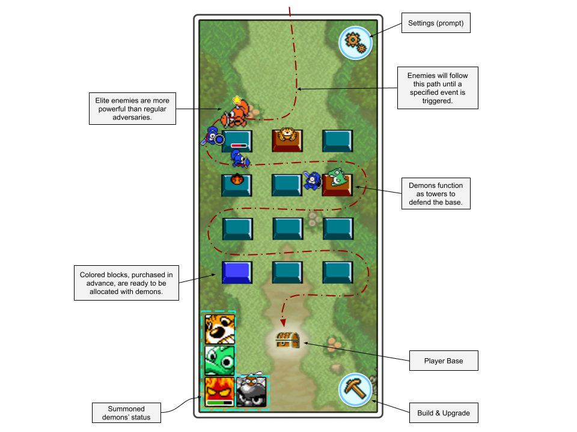

# Demon Ranch

- **Team Name:** Superslime
- **Funding Details:**
  - **DOT**: 13qkvAX2eERiocqD7TYFL5Ujqw2wSbUWezj2sfTUcymdFMGQ

## Game Project Overview :page_facing_up:

# Game Project Application Form

## 1. Pitch the Game

### Please describe the game in a short pitch.
"Demon Ranch" introduces players to a captivating tower defense experience, where Pokémon-like creatures known as Demons serve as formidable defense units safeguarding the base. While the journey of collecting and enhancing these creatures adheres to established tower defense game mechanics, the true essence of Demon Ranch lies in its innovative breeding system, promising uniquely rewarding outcomes. These monsters, represented as tokens, offer players a dynamic marketplace where they can engage in thrilling trades with fellow players or cater exclusively to collectors. Inspired by the allure of collectible card games, this feature serves as the heart and soul of Demon Ranch, promising an exhilarating adventure filled with strategic depth and boundless possibilities.

### Please describe the game's core loop? (minimalistic)
__Planning__ Phase -> __Action__ Phase (tower defence) -> __Breed__ (generate monsters) -> __Customize__ Base

### Are there any existing games that you would consider similar to your project?

The tower defense genre is very popular in the game market, with many examples in the on-chain market such as [Plants vs. Undead](https://plantvsundead.com/), [Crazy Defence Heroes](https://crazydefenseheroes.com/) and [Rise of Cats](https://play.catecoin.club/). However, none of these are fully mobile compatible nor are they similar in scope to our project. We aim to provide a simple, fair and an original experience.

### Do you have a Game Design Document (GDD) for your project?
To create a thorough document, initial funding is necessary. In the meantime, we offer a basic design concept one-pager for a brief preview below.

## 2. Game Dev Experience

### Have you built games prior to this bounty request?
Before embarking on our commercial ventures and working with each other in our professional life, we honed our skills and creativity through numerous non-commercial projects in game jams. These events allowed us to experiment, innovate, and collaborate, fostering a strong foundation and passion that drives our current efforts. While we may not yet be seasoned professionals, we are eager to gain more experience in the field. Our enthusiasm and dedication drive us to continuously learn and improve as we take on new challenges.

### Do any of the previously mentioned games have a Web3 component?
Sadly, no.

### Do you have experience in working with game engines, such as Unity & Unreal?
As a team, we have also worked together at Phoca.io, developing various mobile titles such as: [Combat Blitz](https://apps.apple.com/us/app/combat-blitz/id6498898924), [Your Virtual Baby](https://apps.apple.com/us/app/your-virtual-baby/id1663782255), [Rat Hunter](https://apps.apple.com/us/app/rat-hunter/id6476625924), [Throw On Time](https://discord.com/channels/@me/1027857227517792256/1232970058322673664), [Affair Match](https://apps.apple.com/us/app/affair-match/id6473894918).

## 3. Technical Expertise

### How much of your game logic do you intend to build on the blockchain?
- [ ] None, I just want a token.
- [x] Only the Game Assets/NFTs should remain on-chain.
- [ ] Some mechanics will need to be on-chain.
- [ ] This should be a fully on-chain game.
- [ ] Other: 

### Do you have any expertise in Blockchain Development?
- [ ] No, none at all.
- [x] I know how the Blockchain works, but never developed anything in crypto.
- [ ] I have EVM / SmartContract experience.
- [ ] I have only used SDK for my games on other platforms.
- [ ] I know Rust & Substrate and can create basic runtime code.
- [ ] Other:

### Would you like a technical Team from Polkadot Play, to help you identify the technical requirements?
We may need support for smart contract integration.

## 4. The Team

### Could you share insights about team members who are essential to your project's success? Highlight their specific skill sets and contributions to the game development. 

#### Team member #1
Devrim ERDÖL will be responsible for the game's design, feel, and look. He has worked as a 3D Generalist, Technical Artist, and Art Lead at various game studios. He established his own team (LIME) to led them for a year, gaining in-depth experience in the mobile gaming field. Devrim has collaborated with major publishers like Rollic, Voodoo, and Netmarble.

#### Team member #3
Berkcan BAYRAM, as a Backend Developer, oversees engine iterations and implements on-chain SDKs. With two years of experience at Phoca.io, he developed over 50 prototypes for Rovio and launched dozens of successful games on app platforms. Graduating top of his class in web design and programming, Berkcan continued his success in university studies. His achievements include placing second in the Gameathon game jam organized by Izmir University of Economics. Additionally, by contributing to game development projects for Moone Games, he has demonstrated his ability to excel in competitive environments.

#### Team member #2
Emir GÜZEL is a dedicated and self-taught Gameplay Engineer known for his expertise in creating smooth gameplay experiences and enhancing quality of life features, including UI implementation. His programming journey began in childhood with a focus on cyber security before transitioning to game development. By the age of 18, Emir secured his first professional role at Phoca.io, where he worked for two years as a Game Developer. During his tenure, he gained valuable experience collaborating with various publishers such as Moone Games and Ruby Games, the latter of which was subsequently acquired by Rovio. Emir has also honed his skills through participation in game jams such as Izmir University of Economics where his team secured the first place.

### Team LinkedIn Profiles
[Devrim E.](https://www.linkedin.com/in/devrim-erdol/)
[Emir G.](https://www.linkedin.com/in/emirguzel/)
[Berkcan B.](https://www.linkedin.com/in/berkcan-bayram/)

### Team Github Profiles
[Devrim E.](https://github.com/steryo)
[Emir G.](https://github.com/emrguzel)
[Berkcan B.](https://github.com/berkcannbayramm)

## 5. Development

### Development Status :open_book:

### What are the key milestones for your game's development, and what are the estimated completion dates for each?
- **Milestone 1:** Fully-functional prototype using essential assets and placeholders.
- **Milestone 2:** Playable alpha stage featuring additional assets, resembling a vertical slice.
- **Milestone 3:** Closed beta stage, where all base assets are implemented and ready for extensive testing.
- **Milestone 4:** Open beta phase for public testing and comprehensive polishing.

### Are you intending to raise more funds?
- No.

## 6. Detailed Development Roadmap :nut_and_bolt:

### Overview

- **Total Estimated Duration:** 4 months
- **Full-Time Equivalent (FTE):**  
- **Total Costs:** 4800 DOT

### Milestone 1 — Prototype

- **Estimated duration:** 1 month
- **FTE:**  2,8
- **Costs:** 1200 DOT

| Number | Deliverable | Specification |
| -----: | ----------- | ------------- |
| 0a. | GDD | We will create a comprehensive and detailed Game Design Document (GDD) that includes the core game loop, game narrative, character designs, level designs, and gameplay mechanics. |
| 0b. | Art Style | We will decide on the art style of the game, detailing the visual aesthetics, color palettes, character designs, and environment styles. Finalize concept art and visual references. |
| 1. | Core Gameplay | We will start working on the basic gameplay elements, including enemy and tower design, combat mechanics, and initial level design. |
| 2. | Basic UI & UX | We will develop the basic user interface and user experience elements, HUD, and navigation systems. Design wireframes and conduct usability testing. |

### Milestone 2 — Playable Alpha

- **Estimated duration:** 1 month
- **FTE:**  2,8
- **Costs:** 1200 DOT

| Number | Deliverable | Specification |
| -----: | ----------- | ------------- |
| 1. | Analytics:| Implement comprehensive analytics to gather detailed data for better beta testing and informed decision-making. |
| 2. | Asset Pipeline:| Develop and streamline the asset pipeline to ensure efficient asset creation, management, and integration within the game. |
| 3. | Advanced Gameplay Mechanics: | Design and implement enhanced gameplay elements, focusing on improving player engagement and experience. |
| 4. | Polkadot Integration: | Integrate basic wallet functionality with Polkadot to enable secure in-game transactions and interactions. |
| 5. | Sound Effects (SFX) | Fully integrate high-quality sound effects for enemies and various gameplay elements to enhance the auditory experience. |

### Milestone 3 — Closed Beta / Private Test

- **Estimated duration:** 1 month
- **FTE:**  2,8
- **Costs:** 1200 DOT

| Number | Deliverable | Specification |
| -----: | ----------- | ------------- |
| 1. | Asset variation: | Create and implement diverse asset variations to enhance visual interest and reduce repetitiveness in the game environment. |
| 2. | Juice: | Improve game feel through the addition of particle effects, easing transitions, and other visual and auditory enhancements to make interactions more satisfying. |
| 3. | Music: | Compose and integrate an immersive soundtrack to enhance the overall gaming experience, including background music. |
| 4. | User Experience Enhancment: | Refine the user interface and experience by making intuitive adjustments and incorporating feedback to ensure seamless and enjoyable gameplay. |
| 5. | Token Generation: | Develop and implement NFT-based token generation and integrate wallet functionality to support in-game transactions securely. | 
| 6. | Wallet Funcionality Testing: | Conduct thorough testing of the wallet integration feature to ensure seamless and secure connectivity for in-game transactions. |

### Milestone 4 — Release

- **Estimated duration:** 1 month
- **FTE:**  3,0
- **Costs:** 1200 DOT

| Number | Deliverable | Specification |
| -----: | ----------- | ------------- |
| 1. | Post Processing: | Implement advanced post-processing effects to improve overall gameplay visuals. Specific tasks include the addition of bloom, depth of field effects. |
| 2. | Bug fixes: | Address and fix various bugs affecting game feel, focusing on enhancements such as particle effects and easing transitions for smoother gameplay. |
| 3. | Post Release Support: | Provide ongoing support post-release, ensuring any emerging issues are resolved promptly and integrating new features based on user feedback. |

## 7. Future Plans

We aim to establish a fresh IP exclusively for the DOT ecosystem, making it both easy and convenient to develop additional games around it.

## 8. Additional Information :heavy_plus_sign:

### How did you hear about the Grants Program?
- [x] Polkadot Play Website
- [ ] Twitter
- [ ] Medium
- [x] Personal recommendation
- [ ] Other: