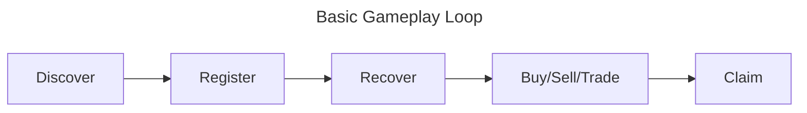
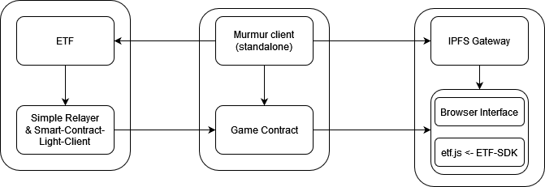

# Fragments

- **Team Name:** Ideal Labs + Chainsafe Gaming
- **Funding Details:**
  - **DOT**: For the **DOT** compensation, please provide a Polkadot address. (ex. multisig, with core contributors)

## Game Project Overview :page_facing_up:

# Game Project Application Form

## 1. Pitch the Game

While Web3 games inherit many benefits from their trustless architecture, providing players with greater control and ownership over assets, gameplay and futures development, it comes at a cost. Traditional online gaming's trusted infrastructure allows for the easy injection of randomness into gameplay as well as easy multiparty interactions (i.e. coin-flipping protocols). In addition, web2 gaming infrastructure doesn't burden the player with issues such as front-running, which provides unfair advantages for dishonest players. In this proposal, we present a mechanism that introduces publicy verifiable on-chain randomness and timelock encryption capabilities for web3 games. 

The Ideal Network is a Substrate-based blockchain which implements a post-finality gadget (ETF-PFG) that produces a publicly verifiable randomness beacon via threshold BLS signatures and DLEQ proofs. 

The details of this scheme can be found in the [GDD](https://chainsafe.notion.site/Game-Design-Document-for-Fragments-70ad7d8efec14fa68de9f6f4e5be55f4).

### Please describe the game in a short pitch.

"Fragments" is a blockchain-based game that combines the thrill of a treasure hunt with the complexities of time-sensitive economic decisions. Players collect fragments that are time-locked and become available at predetermined block numbers. The game leverages the unique capabilities of the ** ** to manage these interactions securely and transparently

### Please describe the game's core loop? (minimalistic)
> **Example** Battle (Action) -> Loot (Reward) -> Buy/Sell -> Upgrade

### Are there any existing games that you would consider similar to your project?
*If so, please list them and describe how your game compares or differs.*

> **Example** blah blah blah same same but different, Tetris, with an integrated on-chain platformer

### Do you have a Game Design Document (GDD) for your project?

https://chainsafe.notion.site/Game-Design-Document-for-Fragments-70ad7d8efec14fa68de9f6f4e5be55f4

## 2. Game Dev Experience

### Have you built games prior to this bounty request?
- **If yes,** *please list game name(s) & links:*
> **Example** blah blah blah, I was part of the core team from Bowser Jr., and helped to tackle down Peach, [Super Mario Kart](https://www.nintendo.com/us/store/products/mario-kart-8-deluxe-switch/)

### Do any of the previously mentioned games have a Web3 component?
- **If yes,** *please describe the Web3 components, link reference & blockchain ecosystem:*
> **Example** NO, blah blah blah I never did a web3 game.

### Do you have experience in working with game engines, such as Unity & Unreal?
- **If yes,** *please include some insights:*
> **Example** YES, blah blah blah I worked with Unity and created a few games, checkout the links, showing [my portfolio](https://pokemongolive.com/).

## 3. Technical Expertise

### How much of your game logic do you intend to build on the blockchain?
- [ ] None, I just want a token.
- [ ] Only the Game Assets/NFTs should remain on-chain.
- [ ] Some mechanics will need to be on-chain.
- [x] This should be a fully on-chain game.
- [ ] Other: 

### Do you have any expertise in Blockchain Development?
- [ ] No, none at all.
- [ ] I know how the Blockchain works, but never developed anything in crypto.
- [x] I have EVM / SmartContract experience.
- [ ] I have only used SDK for my games on other platforms.
- [x] I know Rust & Substrate and can create basic runtime code.
- [x] Other: Highly experienced in Rust & Substrate and can develop new runtime code.

### Would you like a technical Team from Polkadot Play, to help you identify the technical requirements?

Yes, we would. While we believe we have an excellent understanding of the technical requirements for this proposal, we would very much appreciate another look/perspective, as there undoubtedly some unknowns or things we may have overlooked. We do not have any specific pain points at the moment. In addition, we would appreciate technical expertise in reviewing our game logic and implementation, as we have not developed a production-ready ink! based game before.

## 4. The Team

### Could you share insights about team members who are essential to your project's success? Highlight their specific skill sets and contributions to the game development. 

(ordered alphabetically)

#### Juan Girini

#### Coleman Irby

#### Martin Maurer

#### Carlos Montoya

#### Tony Riemer

### Team Code Repos
> **Example** - https://github.com/pintendo/superbowsermart

### Team LinkedIn Profiles (if available)
> **Example** - [Bowser Jr.](https://www.linkedin.com/)

## 5. Development

### Development Status :open_book:

If you've already started implementing your project or it is part of a larger repository, please provide a link and a description of the code here.

The Ideal Network is a substrate-based chain with a novel consensus mechanism (as a post finality gadget) enabling publicly verifiable on-chain randomness and timelock encryption. Our development thus far has been exclusively funded by the web3 foundation, both through the open grants program and now as part of the Decentralized Futures initiative: https://medium.com/web3foundation/decentralized-futures-introducing-etf-network-cd8282be6143.

The Ideal Labs github is here: https://github.com/ideal-lab5 where you can find the repositories we will use in developing this proposal, including the [ETF repo](https://github.com/ideal-lab5/etf), [etf.js](https://github.com/ideal-lab5/etf.js), and [etf-sdk](https://github.com/ideal-lab5/etf-sdk).

You can read more about how it works at: https://medium.com/@ideal_labs/the-etf-post-finality-gadget-1dd6d7f12034
We have previously built some proof-of-concepts on the Ideal Network, such as: https://ideallabs.substack.com/p/p2p-semi-autonomous-games-part-3?utm_source=profile&utm_medium=reader2

### What are the key milestones for your game's development, and what are the estimated completion dates for each?

This proposal consists of two major milestones. Our first milestone is purely technical, where we modify our network, the Ideal Network, so that the [ETF-PFG](https://medium.com/@ideal_labs/the-etf-post-finality-gadget-1dd6d7f12034) can support smart contract light clients. With this capability, we then develop the game logic as a completely on-chain game, implemented as an ink! smart contract hosted on the Ideal network. We note that this stands as a proof-of-concept before we can attempt to do the same with contracts implemented on other chains. Alongside the game logic, we develop a standalone client that acts as a sort of 'game launcher': The "Murmur" client. The client is responsible for producing the timelock encrypted 'fragment' payloads (and merkle mountain ranges - thus the name murmur), adding them to IPFS, and deploying a new game contract seeded with cryptographic commitments to the fragments. For several reasons, e

- **Milestone 1:** Develop a **smart contract light client** and centralized **relayer component**.
  Similar to BEEFY, the ETF-PFG works by broadcasting a stream of justifications that can be subscribed to. This milestone implements a custom relayer component that relays ETF justifications to a smart contract light client. This forms the basis for enabling randomness and timelock encryption capabilities for the game contract (and for many other uses cases in the future). It also serves as an initial attempt at 'bridging' the Ideal network's randomness (even though we will implement it as a 'bridge to itself', i.e. the contract is deployed on the Ideal Network).

- **Milestone 2:** Implement the Fragments game contract and Murmur Client

  This milestone implements two pieces:
  1) The Murmur Client: A standalone Rust client that produces payloads for the Murmur fragments
  2) The Fragments Game Contract: An ink! smart contract that implements the logic for the Fragments game contract. 

### Are you intending to raise more funds?
- **If yes,** please describe what you expect to be the full amount needed to finalize the product.

## 6. Detailed Development Roadmap :nut_and_bolt:

This section should break the development roadmap down into milestones and deliverables. Whenever milestones are delivered, we refer to this document to ensure that everything has been delivered as expected.

Below we provide an **example roadmap**. In the descriptions, it should be clear how your game project is related to Substrate, Kusama, Polkadot, or a (System-)Parachain. We *recommend* that teams structure their roadmap as 1 milestone ≈ 1 month.

> :exclamation: If any of your deliverables are based on somebody else's work, make sure you work and publish *under the terms of the license* of the respective project and that you **highlight this fact in your milestone documentation** and in the source code if applicable! **Projects that submit other people's work without proper attribution will be immediately terminated.**

### Overview

- **Total Estimated Duration:** 6 weeks
- **Full-Time Equivalent (FTE):**  4
- **Total Costs:** 10000 DOT

### Milestone 1: Smart Contract Light Client

- **Estimated duration:** 2 weeks
- **FTE:**  1.5
- **Costs:** 500 DOT

> :exclamation: **The default deliverables 0a-0d below are mandatory for all milestones**, and deliverable 0e at least for the last one. Examples of steps are shown in 1 - 8.

| Number | Deliverable | Specification |
| -----: | ----------- | ------------- |
| **0a.** | License | Specify the IP owning entity; ensure proper copyright compliance for all reused materials, including appropriate licenses and attributions, or choose an open-source license (Apache 2.0, GPLv3, MIT, Unlicense). |
| **0b.** | Documentation | Provide comprehensive **inline documentation** of the code and a detailed **tutorial**. The tutorial should guide users on how to set up, play the game, and assess the milestone's deliverables, ensuring functionality and compliance with the milestone objectives. |
| **0c.** | Testing and Testing Guide | Core functions will be fully covered by comprehensive unit tests to ensure functionality and robustness. In the guide, we will describe how to run these tests. |
| **0d.** | Platform | Provide a detailed description of the game's platform compatibility and the infrastructure setup required to host and run the game, including supported operating systems, hardware requirements, and necessary backend services. |
| 0e. | Article | We will publish an **article**/workshop that explains [...] (what was done/achieved as part of the games bounty). (Content, language, and medium should reflect your target audience described above.) |
| 1. | SCLC: Ideal Network - Runtime and Pallets Upgrade | We modify the Ideal Network runtime to enable the "Smart Contract Light Client". This includes creating a new pallet to store cryptographic commitments required for efficient onchain verification of ETF justifications with the smart contract.  |
| 2. | SCLC: Relayer Component | We implement a centralized relayer which is responsible for subscribing to ETF justifications, interpolating signatures and aggregating proofs, and sending the aggregated messages to the SCLC. |
| 3. | SCLC: The Contract | We develop and deploy the actual smart contract light client. Since we are using a centralized relayer for now, this is a very simple contract, allowing an authorized origin (the relayer) to write new blocks only. The contract also implements logic to efficiently verify the signature (by verifying an included ZKP). |

### Milestone 2: E2E Game Development

- **Estimated Duration:** 1 month
- **FTE:**  3.5
- **Costs:** 4000 DOT

| Number | Deliverable | Specification |
| -----: | ----------- | ------------- |
| **0a.** | License | Specify the IP owning entity; ensure proper copyright compliance for all reused materials, including appropriate licenses and attributions, or choose an open-source license (Apache 2.0, GPLv3, MIT, Unlicense). |
| **0b.** | Documentation | Provide comprehensive **inline documentation** of the code and a detailed **tutorial**. The tutorial should guide users on how to set up, play the game, and assess the milestone's deliverables, ensuring functionality and compliance with the milestone objectives. |
| **0c.** | Testing and Testing Guide | Core functions will be fully covered by comprehensive unit tests to ensure functionality and robustness. In the guide, we will describe how to run these tests. |
| **0d.** | Platform | Provide a detailed description of the game's platform compatibility and the infrastructure setup required to host and run the game, including supported operating systems, hardware requirements, and necessary backend services. |
| 0e. | Article | We will publish an **article**/workshop that explains [...] (what was done/achieved as part of the games bounty). (Content, language, and medium should reflect your target audience described above.) |
| 1. | Backend Module: The Murmur Client | This is a standalone rust client responsible for deriving the encrypted payloads that each fragment contains. Specifically, it functions as described [here](https://chainsafe.notion.site/Technology-3cd66a1474bb47029f361d401bd48cfa). Beyond this, the client adds the encrypted fragment payloads to IPFS and has the capability to interact with the chain, where it is responsible for deployed new instances of the game contract. | 
| 2. | Smart Contract: The Fragments Game Contract | We implement the fragments game logic within an ink! smart contract. The contract is deployed by the murmur client and seeded with cryptographic commitments to the derived fragments. It also stores references to IFPS CIDs of each of the encrypted (timelocked) fragments. | 
| 3. | Frontend Module: Simple Browser-Based Game Interface | We develop a simple browser-based game interface that uses the etf.js library to perform timelock encryption/decryption and to interact with the game contract and chain (through polkadot-js). |

I left the following for posterity. These are other items/descriptions from the template :

| 2. | Frontend module: Y | We will create a frontend (Unity, Unreal or other) in .... (please provide essential parts that are captured in the frontend) |
| 3. | Asset Layer: Z | We will create an asset layer consisting of those asset models ... (provide the concept and data model of your game assets) ... |
| 4. | Substrate chain | Modules X, Y & Z of our custom chain will interact in such a way... (Please describe the deliverable here as detailed as possible) |
| 5. | Library: ABC | We will deliver a JS library that will implement the functionality described under "ABC Library" |
| 6. | Smart contracts: ... | We will deliver a set of ink! smart contracts that will...
| 7. | GDD: ... | We will create an comprehensive Game Design Document (GDD) including the core game loop and the game narrative ... |
| 8. | BSA: ... | We will create an Blockchain Solution Architecture (BSA) showing the proper interaction of the game with the Blockchain elements and ... |

## 7. Future Plans

Please include here

- how you intend to finance the project's long-term maintenance and development,
- how you intend to use, enhance, and promote your project in the short term, and
- the team's long-term plans and intentions in relation to it.

## 8. Additional Information :heavy_plus_sign:

### While we've covered a range of topics, there might still be questions or areas of uncertainty on your side or ours. We encourage you to share any additional thoughts, questions, or concerns you may have, with us.

### How did you hear about the Grants Program?
- [ ] Polkadot Play Website
- [ ] Twitter
- [ ] Medium
- [ ] Personal recommendation
- [x] Other: github, polkadot forum
